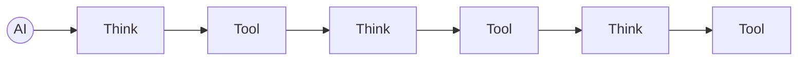
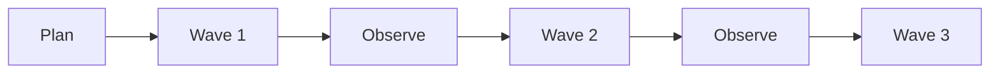
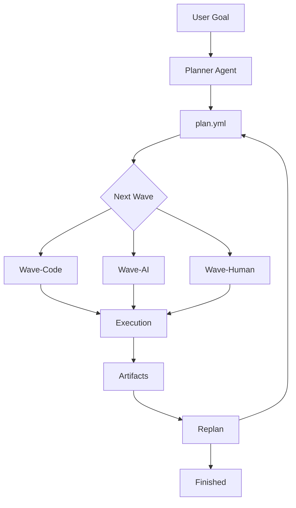
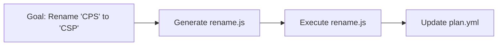
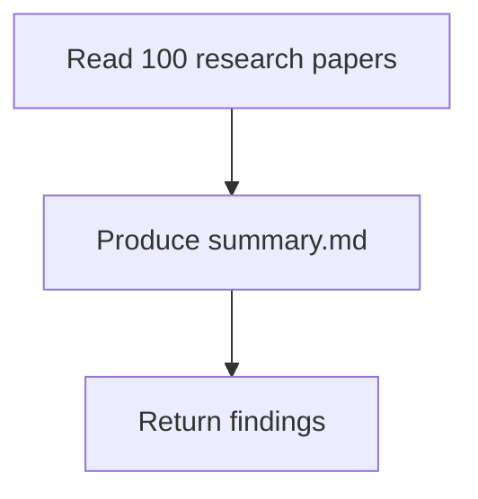
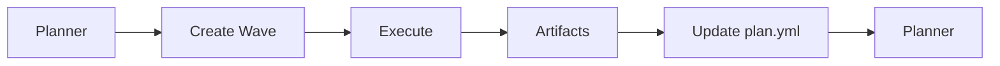
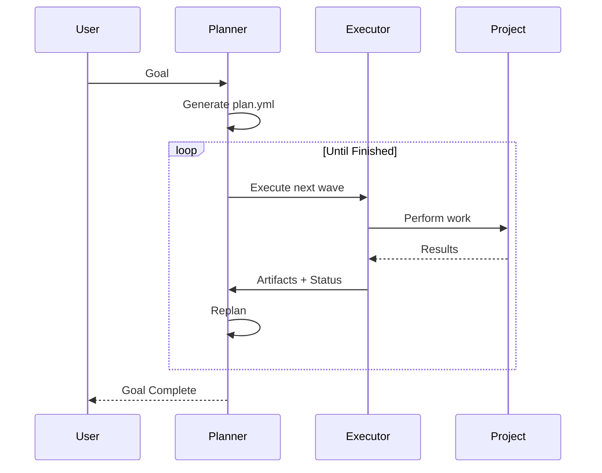

# Waves Compiler

> **Version:** 0.1 (Concept)
>
> **Tagline:** *Compile goals into executable waves.*

---

# Overview

**Waves Compiler** is an AI execution architecture that separates **planning** from **execution**.

Instead of allowing an AI agent to continuously think, call tools, think again, and repeat until a task finishes, Waves Compiler introduces a planning system that divides work into **waves**.

Each wave has a single goal and is executed by the most appropriate executor.

The system continuously replans after every completed wave until the overall goal is achieved.

---

# Philosophy

Traditional AI agents behave like interpreters.



The AI remains responsible for every decision throughout execution.

Waves Compiler changes this philosophy.

The AI plans.

Specialized executors execute.

The planner only returns after a wave has completed.

---

# Core Principles

## 1. Planning is independent from execution

The Planner Agent never executes work.

Its responsibilities are:

- Understand the user's goal.
- Create or update `plan.yml`.
- Select the next wave.
- Replan after every completed wave.
- Decide when the overall goal is complete.

---

## 2. Every wave has exactly one executor

Each wave is assigned one execution strategy.

Supported executors:

- Wave-Code
- Wave-AI
- Wave-Human

A wave never mixes responsibilities.

---

## 3. The plan is the source of truth

Conversation history is not the primary memory.

Instead, execution is driven by persistent artifacts such as:

```fs
    |-.logs/
    |-.env # secrent reusable values (urls user/passwork)
    |-plan.yml 
    |-task-gole.md # the main gole we want to do it 
    |-wave-1-task-1.md  # input and output of task 1 in wave 1
    
```

A planner should be able to restart from these files without requiring previous chat history.

---

## 4. Work happens in waves

Instead of creating one huge plan, the system continuously replans.



This allows discoveries made during execution to influence future planning.

---

## 5. Executors only execute

Executors never decide the project strategy.

Their job is simply to complete one wave.

---

# Architecture



---

# Planner Agent

The Planner Agent owns the overall strategy.

Responsibilities:

- Interpret the user's request.
- Generate an initial execution plan.
- Split work into waves.
- Choose an executor.
- Replan using execution results.
- Decide whether another wave is required.

The planner never performs implementation work.

---

# Wave Types

## Wave-Code

Purpose:

Compile one wave into executable code.

Possible outputs:

- JavaScript
- TypeScript
- Bash
- PowerShell
- Python

Responsibilities:

- Read the wave.
- Generate the smallest executable solution.
- Execute it.
- Produce artifacts.
- Update `plan.yml`.
- Return control.

Example:



---

## Wave-AI

Purpose:

Use reasoning instead of generated code.

Ideal tasks:

- Read documentation
- Research
- Summarization
- Architecture review
- Design decisions
- Code review
- Root cause analysis

Example:



---

## Wave-Human

Purpose:

Handle tasks that cannot be automated.

Examples:

- Press a physical button.
- Open a door.
- Reboot physical hardware.
- Provide credentials.
- Approve a deployment.
- Scan documents.

Flow:


---

# Wave Lifecycle



---

# plan.yml Example
```yml
active: "wave 2"
taskCompleted: false
wave 1:
    name: "Wave 1: Base Update"
    tasks:
        update dependencies:
            agent: "ai-to-code"
            status: "completed"
        update services:
            agent: "ai-to-code"
            status: "completed"
        update components:
            agent: "ai-to-code"
            status: "completed"

wave 2:
    name: "Wave 2: Finalize Update"
    tasks:
        review code changes:
            agent: "ai"
            status: "todo"
        Create PR:
            agent: "ai"
            status: "complete"
```
---

# Execution Flow



---

# Why Waves?

Instead of attempting to solve an entire project in one execution, Waves Compiler continuously adapts.

Benefits:

- Smaller planning problems.
- Better recovery.
- Easier debugging.
- Lower token usage.
- Better observability.
- Long-running workflows.
- Restartable execution.

---

# Comparison

| Traditional Agent | Waves Compiler |
|-------------------|----------------|
| Think after every tool | Think after every wave |
| Chat is primary memory | Artifacts are primary memory |
| Continuous orchestration | Wave orchestration |
| AI executes everything | Specialized executors |
| Hard to resume | Resume from plan.yml |
| Often repeats planning | Planning is incremental |

---

# Future Ideas

- Parallel wave execution.
- Wave dependency graphs.
- Cost-aware executor selection.
- Automatic retry policies.
- Checkpoint and resume.
- Distributed execution across machines.
- Plugin-based executors.
- Metrics for token, time, and cost optimization.

---

# Vision

Waves Compiler treats AI as a **planner**, not a continuously running controller.

Execution is divided into independent waves.

Each wave is assigned to the most appropriate executor.

The planner learns from the artifacts produced by previous waves and continuously recompiles the plan until the user's goal is achieved.

The result is a system that is resumable, observable, modular, and optimized for long-running AI-assisted workflows.
